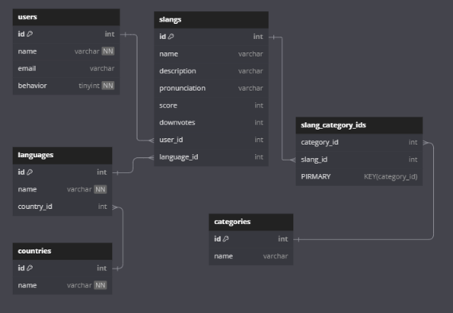

# Design Document

By Aidin Ghazagh

Video overview: <https://www.youtube.com/watch?v=CSnjZqwF2Rc&t=7s>

## Scope

In this section you should answer the following questions:

* The purpose of this database is for people to learn slangs from different languages and also teach other people these slangs

* It is intended for public use

## Functional Requirements

* A user should be able to view already created slangs and also insert new slangs into our database give a slang post a upvote to increase its score or downvote to the opposite

* A normal user should be able to create update or delete users, countries, languages, categories, slangs that they dont have permission to however a user can upvote or downvote another user's slang post

## Representation

### Entities

users:
    Attributes: id (auto-incremented), name, email (UNIQUE), password.
    Types: id (INT UNSIGNED), name (VARCHAR), email (VARCHAR), password (VARCHAR).
    Constraints: primary key on id, emails should be unique.

countries:
    Attributes: id (auto-incremented), name.
    Types: id (INT UNSIGNED), name (VARCHAR, UNIQUE).
    Constraints: primary key on id, names are unique.

languages:
    Attributes: id (auto-incremented), name, country_id.
    Types: id (INT UNSIGNED), name (VARCHAR), country_id (INT UNSIGNED) unique_name_country(UNIQUE KEY).
    Constraints: primary key on id, foregin key on country_id connecting it to country.id, name and country_id are connected by unique key so that a country can't have 2 languages by the same name.

slangs:
    Attributes: id (auto-incremented), name, description, pronunciation, score, user_id, language_id.
    Types: id (INT UNSIGNED), name (VARCHAR), description (VARCHAR), pronunciation (VARCHAR), score (INT), user_id (INT UNSIGNED), language_id (INT UNSIGNED).
    Constraints: primary key on id, foregin key on user_id connecting it to users.id, foregin key on language_id connecting it to languages.id .

categories:
    Attributes: id (auto-incremented), name.
    Types: id (INT UNSIGNED), name (VARCHAR, UNIQUE).
    Constraints: primary key on id, names are unique.

slang_category_ids:
    Attributes: slang_id, category_id.
    Types: slang_id (INT UNSIGNED), category_id (INT UNSIGNED).
    Constraints: primary key on slang_id + category_id, foregin key on slang_id connecting it to slangs.id, foregin key on category_id connecting it to category.id .

### Relationships

 languages.country_id > countries.id
 slangs.language_id > languages.id
 slangs.user_id > users.id
 slang_category_ids.category_id > categories.id
 slang_category_ids.slang_id > slangs.id

## Optimizations

All the primary keys and foregin keys are unsigned integers

Added indexes on columns that are likely to be used in WHERE clauses (email, behavior, name).
Added indexes on foreign key columns to speed up JOIN operations (country_id, user_id, language_id, category_id, slang_id).
Added indexes on columns that might be used for sorting or filtering (score, downvotes).

## Limitations

* The app is dependent on the users to function properly
* the database cant represent a wide range of categories since they have to be created by a admin
